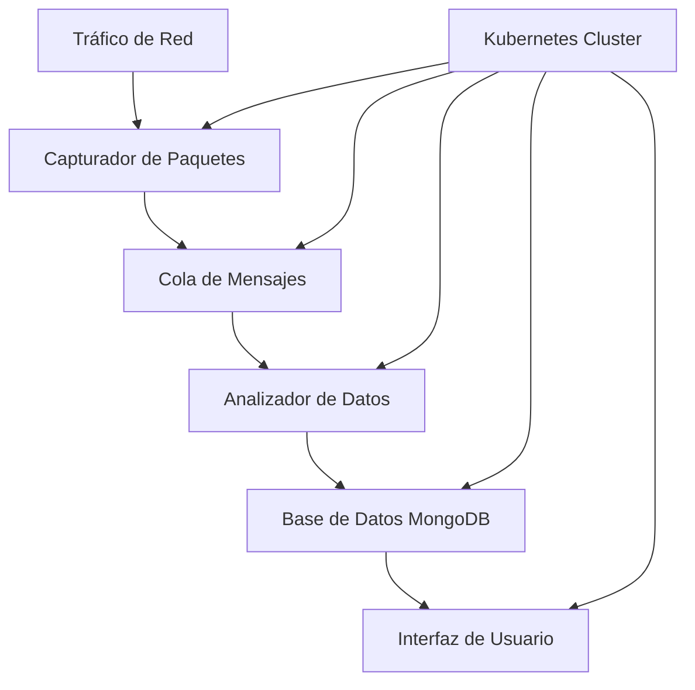
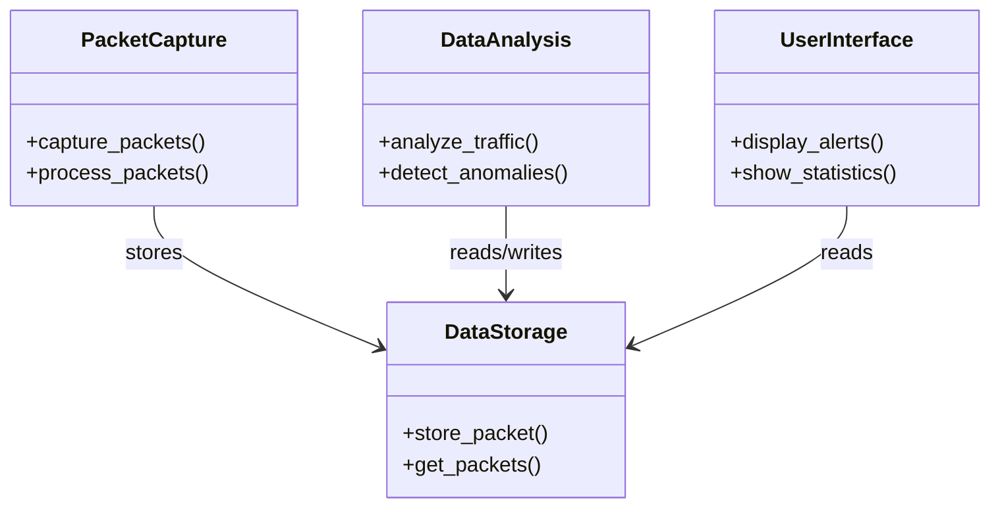
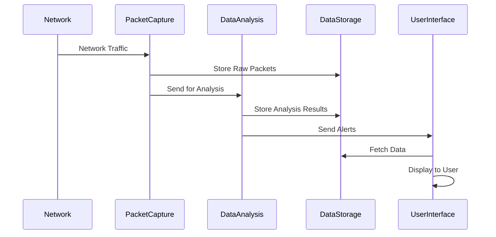

# Diseño y Arquitectura del Sistema Distribuido de Detección de Intrusiones (dIDS)

## Tabla de Contenidos
1. [Visión General](#visión-general)
2. [Arquitectura del Sistema](#arquitectura-del-sistema)
3. [Componentes Principales](#componentes-principales)
4. [Flujo de Datos](#flujo-de-datos)
5. [Tecnologías Utilizadas](#tecnologías-utilizadas)
6. [Consideraciones de Diseño](#consideraciones-de-diseño)
7. [Diagramas](#diagramas)
8. [Referencias](#referencias)

## Visión General

El Sistema Distribuido de Detección de Intrusiones (dIDS) es una solución de seguridad de red diseñada para identificar y alertar sobre actividades sospechosas en tiempo real. Utiliza técnicas de análisis distribuido y aprendizaje automático para procesar grandes volúmenes de tráfico de red de manera eficiente.

## Arquitectura del Sistema

El dIDS sigue una arquitectura de microservicios containerizada, desplegada en un clúster de Kubernetes. Esta arquitectura permite una alta escalabilidad, resistencia a fallos y facilidad de mantenimiento.

### Diagrama de Arquitectura

## Componentes Principales

- **Capturador de Paquetes:**

   - Implementado en packet_capture.py
   - Utiliza Scapy para capturar tráfico de red en tiempo real
   - Ejecuta múltiples procesos para un rendimiento óptimo

- **Analizador de Datos:**

   - Implementado en data_analysis.py
   - Procesa los paquetes capturados para detectar patrones sospechosos
   - Utiliza algoritmos de detección de anomalías y aprendizaje automático

- **Almacenamiento de Datos:**

   - Implementado en data_storage.py
   - Utiliza MongoDB para almacenar paquetes de red y resultados de análisis
   - Proporciona una interfaz para operaciones CRUD

- **Interfaz de Usuario:**

   - Implementada como un servicio web separado
   - Muestra alertas, estadísticas y permite la configuración del sistema

- **Orquestación de Contenedores:**

   - Utiliza Kubernetes para gestionar y escalar los componentes del sistema

## Flujo de Datos

- El Capturador de Paquetes intercepta el tráfico de red.
- Los paquetes capturados se envían a una cola de mensajes para su procesamiento.
- El Analizador de Datos consume los paquetes de la cola y realiza análisis en tiempo real.
- Los resultados del análisis y los paquetes relevantes se almacenan en MongoDB.
- La Interfaz de Usuario consulta la base de datos para mostrar alertas y estadísticas.

## Tecnologías Utilizadas

- Lenguaje de Programación: Python 3.9
- Captura de Paquetes: Scapy
- Base de Datos: MongoDB
- Análisis de Datos: NumPy, SciPy
- Containerización: Docker
- Orquestación: Kubernetes
- Comunicación entre Servicios: gRPC
- Interfaz de Usuario: Flask (backend), React (frontend)

## Consideraciones de Diseño

**Escalabilidad**:

- Uso de microservicios para escalar componentes individualmente
- Implementación de procesamiento paralelo en la captura y análisis de paquetes

**Rendimiento**:

- Optimización de algoritmos de análisis para procesamiento en tiempo real
- Uso de índices en MongoDB para consultas eficientes

**Seguridad**:

- Implementación de autenticación y autorización en todos los servicios
- Cifrado de datos en tránsito y en reposo

**Tolerancia a Fallos**:

- Replicación de servicios críticos
- Implementación de mecanismos de recuperación automática

**Mantenibilidad**:

- Diseño modular para facilitar actualizaciones y pruebas
- Uso de contenedores para garantizar la consistencia entre entornos

## Diagramas
### Diagrama de Componentes

Este diagrama muestra las principales clases y sus relaciones en el sistema dIDS.

### Diagrama de Secuencia

Este diagrama ilustra el flujo de datos y la secuencia de operaciones en el sistema dIDS.

## Referencias

- [Kubernetes Documentation](https://kubernetes.io/es/docs/)
- [Docker Documentation](https://docs.docker.com/)
- [Scapy Documentation ](https://scapy.net/)
- [MongoDB Documentation](https://docs.mongodb.com/)
- [gRPC Documentation](https://grpc.io/docs/)
- [Flask Documentation](https://www.geeksforgeeks.org/flask-tutorial/)
- [React Documentation](https://react.dev/)
- [Microservices Architecture](https://microservices.io/)
- [Distributed Systems Design](https://medium.com/@nilesh.dabholkar/distributed-systems-design-patterns-architecting-for-scalability-and-reliability-d937a56ff347)

Este documento `DESIGN.md` proporciona una visión técnica y detallada de la arquitectura y diseño del sistema dIDS. Incluye diagramas para una mejor comprensión visual de la arquitectura, los componentes y el flujo de datos. Los diagramas se han creado utilizando la sintaxis de Mermaid, que es compatible con muchos visualizadores de Markdown y plataformas como GitHub.

El diseño abarca los tres sprints del proyecto, considerando la captura de paquetes, el análisis de datos y la interfaz de usuario. También se han incluido consideraciones importantes como la escalabilidad, el rendimiento y la seguridad.

Las referencias proporcionadas al final del documento ofrecen recursos adicionales para profundizar en las tecnologías y conceptos utilizados en el diseño del sistema.
